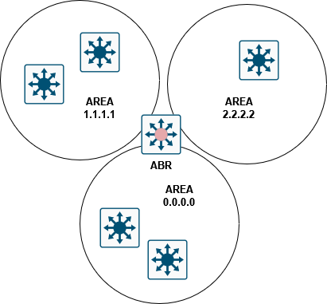
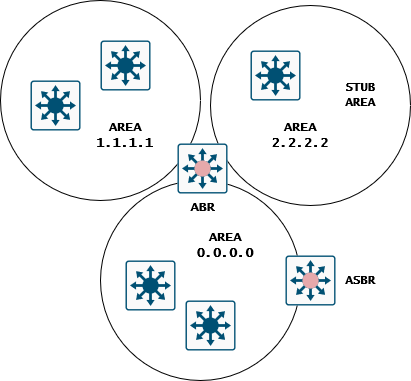
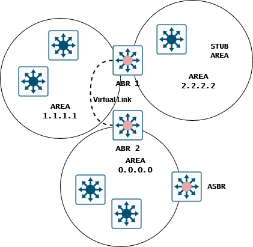

# Open Shortest Path First (OSPF)

## Overview

Open Shortest Path First (OSPF) is an Interior Gateway Protocol (IGP) used to distribute routing information within a single Autonomous System (AS). It is designed expressly for IP networks and supports IP subnetting and tagging of externally derived routing information. OSPF also allows packet authentication and uses IP multicast when sending and receiving packets.

OSPF Version 3 (OSPFv3) expands on OSPF Version 2 by providing support for IPv6 routing prefixes.

## OSPF Areas

#### What is an ABR?

An Area Border Router (ABR) is a router that connects one or more areas to the backbone area. An ABR has at least one interface in the backbone area and one interface in another area.

The ABR holds a different link-state database per area it is connected to.

The ABR sends Network Summary LSAs (Type 3) to the backbone area.

<main></main>

#### What is an ASBR?

An Autonomous System Boundary Router (ASBR) is a router that connects an OSPF area to an external routing domain. An ASBR is responsible for exchanging routing information between the OSPF domain and the external domain.

#### What is a Stub Area?

You can control the flood of external routing information within an area by designating it as a stub area. 

A stub area is a specific type of area that disallows Autonomous System External (type 5) LSAs. Typically, these LSAs are disseminated throughout the local autonomous system to distribute information about external routes.

- All routers in the stub area are stub routers.

- No ASBR routers exist in the stub area.

- You cannot configure virtual links in the stub area.

NOTE: The backbone area (area 0) cannot be a NSSA.

<main></main>

#### What is a NSSA?

A Not-So-Stubby Area (NSSA) is a specific type of stub area that allows the import of Autonomous System External (type 5) LSAs as Intra-Area Prefix LSAs (type 9).

The NSSA ASBR redistributes these routes and generates NSSA External
(type 7) LSAs that it floods throughout the NSSA.

#### What is a OSPF Virtual Link?

A virtual link is a logical connection between two ABRs that are not physically connected. Virtual links are used to connect an area to the backbone area through a non-backbone area.

<main></main>

#### PtP vs Broadcast

- Point-to-Point (PtP) links are used to connect two routers directly together. The link is considered to be a PtP link if the interface is configured with an IP address and subnet mask. **No DR or BDR are required.**

- Broadcast links are used to connect more than two routers together. The link is considered to be a broadcast link if the interface is configured with an IP address, subnet mask, and a broadcast address. **The designation of a DR and a BDR are required for LSA distribution.**

## OSPF Authentication

The Nexus platform support two types of authentication for OSPFv2:

1. Plain text authentication
2. MD5 authentication

OSPFv3 doesn’t have an authentication field in its header like OSPFv2, instead it relies on IPsec.

## OSPF Parameters

<table>
  <thead>
    <tr>
      <th>Parameter</th>
      <th>Default</th>
    </tr>
  </thead>
  <tbody>
    <tr>
      <td>Administrative distance</td>
      <td>110</td>
    </tr>
    <tr>
      <td>Hello interval</td>
      <td>10 seconds</td>
    </tr>
    <tr>
      <td>Dead interval</td>
      <td>40 seconds</td>
    </tr>
    <tr>
      <td>Graceful restart grace period</td>
      <td>60 seconds</td>
    </tr>
    <tr>
      <td>OSPFv2/OSPFv3 feature</td>
      <td>Disabled</td>
    </tr>
    <tr>
      <td>Stub router advertisement announce time</td>
      <td>600 seconds</td>
    </tr>
    <tr>
      <td>Reference bandwidth for link cost calculation</td>
      <td>40 Gbps</td>
    </tr>
    <tr>
      <td>LSA minimal arrival time</td>
      <td>1000 milliseconds</td>
    </tr>
  </tbody>
</table>

## OSPF LSA Types

#### Traditional LSAs
<table>
  <thead>
    <tr>
      <th>Type</th>
      <th>Sent By</th>
      <th>OSPFv2</th>
      <th>Description</th>
      <th>OSPFv3</th>
      <th>Description</th>
    </tr>
  </thead>
  <tbody>
    <tr>
      <td>1</td>
      <td>All Routers</td>
      <td>Router</td>
      <td>This LSA includes the state and the cost of all links and a list of a OSPFv2 neighbors on the link.</td>
      <td>Router</td>
      <td>Same.</td>
    </tr>
    <tr>
      <td>2</td>
      <td>DR</td>
      <td>Network</td>
      <td>List all routers in the local area.</td>
      <td>Network</td>
      <td>Same, but no prefix information.</td>
    </tr>
    <tr>
      <td>3</td>
      <td>ABR</td>
      <td>Network Summary</td>
      <td>Includes costs from the ABR to other area destinations.</td>
      <td>Inter-Area Prefix Area</td>
      <td>Same.</td>
    </tr>
    <tr>
      <td>4</td>
      <td>ABR</td>
      <td>ABR Summary</td>
      <td>This LSA advertises the link cost to the ASBR only.</td>
      <td>Inter-Area Router</td>
      <td>Same.</td>
    </tr>
    <tr>
      <td>5</td>
      <td>ASBR</td>
      <td>AS External</td>
      <td>This LSA includes the link cost to an external autonomous system destination. Flooding to the whole AS.</td>
      <td>AS External</td>
      <td>Same.</td>
    </tr>
    <tr>
      <td>7</td>
      <td>ASBR in NSSA</td>
      <td>NSSA External</td>
      <td>This LSA includes the link cost to an external autonomous system destination. Only flooded within the local NSSA.</td>
      <td>NSSA External</td>
      <td>Same.</td>
    </tr>
    <tr>
      <td>8</td>
      <td>All Routers</td>
      <td>N/A</td>
      <td>N/A</td>
      <td>Link</td>
      <td>This LSA includes the link-local address and IPv6 prefixes for this link.</td>
    </tr>
  </tbody>
</table>

#### Opaque LSAs
<table>
  <thead>
    <tr>
      <th>Type</th>
      <th>Sent By</th>
      <th>OSPFv3</th>
      <th>Description</th>
    </tr>
  </thead>
  <tbody>
    <tr>
      <td>9</td>
      <td>All Routers</td>
      <td>Intra-Area Prefix</td>
      <td>This LSA includes any prefix or link state changes, but DOES NOT trigger SPF recalculation.</td>
    </tr>
    <tr>
      <td>10</td>
      <td>N/A</td>
      <td>N/A</td>
      <td>N/A</td>
    </tr>
    <tr>
      <td>11</td>
      <td>Restarting Router</td>
      <td>Grace</td>
      <td>Flooded to link-local scope.</td>
    </tr>
  </tbody>
</table>

### Configuration

<pre>
OSPFv2

feature ospf
!
router ospf 1
  router-id 1.1.1.1
  log-adjacency-changes
  auto-cost reference-bandwidth 100 Gbps
!
interface vlan 10, 12, 33-44
  ip router ospf 1 area 1
!
interface ethernet 3/22
  ip router ospf 1 area 0
  ip ospf authentication message-digest
  ip ospf message-digest-key 1 md5 password
</pre>

For OSPFv2, the following steps are optional:

- Enable the process on the interfaces.
- Configure per-interface settings.

<pre>
OSPFv3

feature ospfv3
!
router ospfv3 1
  router-id 1.1.1.1
  log-adjacency-changes
  auto-cost reference-bandwidth 100 Gbps
!
interface vlan 10, 12, 33-44
  ip router ospfv3 1 area 1
!
interface ethernet 3/22
  ip router ospfv3 1 area 0
</pre>

For OSPFv3, the following steps are optional:

- Enable the process on the interfaces.
- Configure per-interface settings.

<pre>
Creating a key chain.

key chain mypass
  key 0
    key-string cisco
    exit
exit
</pre>