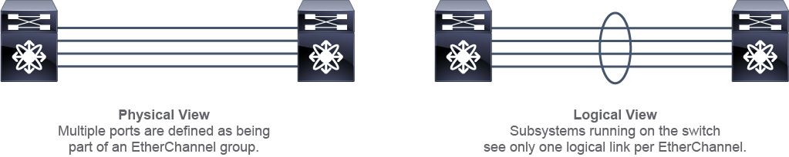

# Link Aggregation Control Protocol (LACP)

### Table of Contents

- [Link Aggregation Control Protocol (LACP)](#link-aggregation-control-protocol-lacp)
    - [Table of Contents](#table-of-contents)
  - [LACP Port Channels](#lacp-port-channels)
    - [Benefits](#benefits)
    - [Specifications](#specifications)
      - [Channel Modes](#channel-modes)
      - [Channel Compatibility](#channel-compatibility)
    - [Configuration](#configuration)

## LACP Port Channels

Link Aggregation Control Protocol (LACP) is a protocol that allows multiple physical links to be bundled into one logical link. LACP allows a network device to negotiate an automatic bundling of links by sending LACP packets to the peer (directly connected device that also implements LACP).

<main>

</main>

**NOTE: LACP is defined by the IEEE in the 802.3ad & 802.1AX standards.**

### Benefits

Benefits and advantages of Port Channels:

- Optimized bandwidth usage

- Improved network convergence

- Spanning-tree mitigation

- Resiliency against physical link failures

### Specifications

The maximum number of ports in a channel depends on the exact switch hardware and software combination. For example, on the Cisco Nexus 9000 Series Switches, you can bundle up to 32 active links into a port channel.

**NOTE: Nexus 9k can bundle up to 32 active links in a port channel.**

On the Cisco Nexus 9000 platform, port channels can be configured on Layer 2 or Layer 3 interfaces.

**NOTE: Nexus 9k port channels can be configured on layer 2 and layer 3 interfaces.**

#### Channel Modes

<table>
  <thead>
    <tr>
      <th>Channel Mode</th>
      <th>Port Description</th>
    </tr>
  </thead>
  <tbody>
    <tr>
      <td>Passive (LACP)</td>
      <td>Responds to LACP packets that it receives, does not initiate LACP negotiation</td>
    </tr>
    <tr>
      <td>Active (LACP)</td>
      <td>Initiates negotiations with other ports by sending LACP packets</td>
    </tr>
    <tr>
      <td>On (static)</td>
      <td>Does not send any LACP packets, does not join any LACP channel groups, becomes an individual link with that interface</td>
    </tr>
  </tbody>
</table>

#### Channel Compatibility

<table>
  <thead>
    <tr>
      <th></th>
      <th>Passive</th>
      <th>Active</th>
      <th>On</th>
    </tr>
  </thead>
  <tbody>
    <tr>
      <td>Passive</td>
      <td>NO</td>
      <td>YES</td>
      <td>NO</td>
    </tr>
    <tr>
      <td>Active</td>
      <td>YES</td>
      <td>YES</td>
      <td>NO</td>
    </tr>
    <tr>
      <td>On</td>
      <td>NO</td>
      <td>NO</td>
      <td>YES</td>
    </tr>
  </tbody>
</table>

### Configuration

<pre>
Enable LACP
<code>(config)# feature lacp</code>
</pre>

<pre>
Configure LACP
<code>(config)#interface <i>type slot / port</i></code>
<code>(config-if)#channel-group <i>number</i> mode { active | on | passive } </code>
</pre>