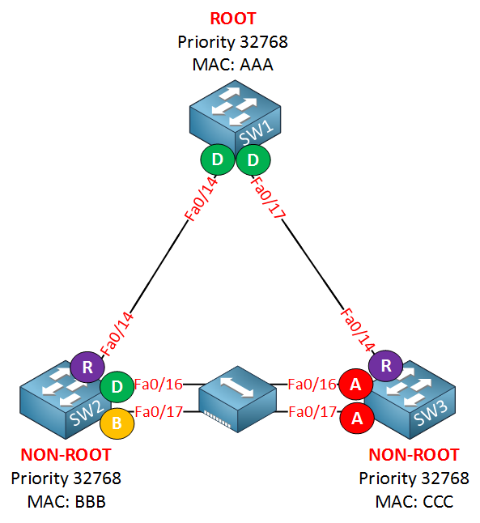

# Link Aggregation Control Protocol (LACP)

## Overview

Rapid PVST+ is a network protocol that ensures quick recovery of network connectivity in the event of a device, switch port, or LAN failure. It offers fast convergence for edge ports and is an implementation of the IEEE 802.1w (RSTP) standard on a per-VLAN basis. For each VLAN configured, a single instance of STP runs, with each Rapid PVST+ instance having a single root switch. STP can be enabled or disabled on a per-VLAN basis when using Rapid PVST+.

**NOTE**: Rapid PVST+ is the default STP mode for Nexus switches and uses point-to-point wiring for quick spanning tree convergence.

Rapid PVST+ supports one STP instance for each VLAN. It allows for quick STP convergence, with each designated or root port in the STP sending out a BPDU every two seconds by default. If three consecutive hello messages are missed, or if the maximum age expires, the port immediately flushes all protocol information in the table.

Rapid PVST+ ports are connected through point-to-point links in the following ways:

- **Edge ports**: These ports transition to the forwarding state immediately when configured as an edge port on an RSTP switch. They should only be configured on ports that connect to a single end device and do not generate topology changes when the link changes.

- **Root ports**: If a new root port is selected by Rapid PVST+, it blocks the old root port and immediately transitions the new root port to the forwarding state.

- **Point-to-point links**: If a port is connected to another port through a point-to-point link and the local port becomes a designated port, it negotiates a rapid transition with the other port using the proposal-agreement handshake to ensure a loop-free topology.

When Rapid PVST+ identifies a change in the network layout, it takes two main actions:

1. It starts a timer, known as the TC While timer, for all non-edge root and designated ports. The timer is set to a value that's double the duration of the hello time, if needed.

2. It clears out the MAC addresses that are linked with all these ports.

## Port States

Rapid PVST+ ensures quick adjustment of the spanning tree by assigning roles to ports and understanding the active network structure. It builds upon the 802.1D STP to select the switch with the highest priority (or the lowest numerical priority value) as the root bridge. Rapid PVST+ then assigns one of the following roles to each port:

<main></main>

- **Root port**: This port provides the most efficient path (lowest cost) for the switch to forward packets to the root bridge.

- **Designated port**: This port connects to the designated switch, which has the lowest path cost when forwarding packets from that LAN to the root bridge. The port that the designated switch uses to connect to the LAN is known as the designated port.

- **Alternate port**: This port provides an alternative route to the root bridge, different from the current root port's path. An alternate port provides a path to another switch in the network.

- **Backup port**: This port serves as a backup for the path provided by a designated port towards the leaves of the spanning tree. A backup port can only exist when two ports are connected in a loopback by a point-to-point link, or when a switch has multiple connections to a shared LAN segment. A backup port provides an additional path in the network to the switch.

- **Disabled port**: This port does not play any role in the operation of the spanning tree.

<table>
  <thead>
    <tr>
      <th>Operational Status</th>
      <th>Port State</th>
      <th>Is Port Included in Active Topology?</th>
    </tr>
  </thead>
  <tbody>
    <tr>
      <td>Enabled</td>
      <td>Blocking</td>
      <td>No</td>
    </tr>
    <tr>
      <td>Enabled</td>
      <td>Learning</td>
      <td>Yes</td>
    </tr>
    <tr>
      <td>Enabled</td>
      <td>Forwarding</td>
      <td>Yes</td>
    </tr>
    <tr>
      <td>Disabled</td>
      <td>Disabled</td>
      <td>No</td>
    </tr>
  </tbody>
</table>

## Port Costs

<table>
  <thead>
    <tr>
      <th>Bandwidth of Port</th>
      <th>Short Path-Cost (Metric)</th>
      <th>Long Path-Cost (Metric)</th>
    </tr>
  </thead>
  <tbody>
    <tr>
      <td>10 Mbps</td>
      <td>100</td>
      <td>2,000,000</td>
    </tr>
    <tr>
      <td>100 Mbps</td>
      <td>19</td>
      <td>200,000</td>
    </tr>
    <tr>
      <td>1 Gbps</td>
      <td>4</td>
      <td>20,000</td>
    </tr>
    <tr>
      <td>10 Gbps</td>
      <td>2</td>
      <td>2,000</td>
    </tr>
    <tr>
      <td>40 Gbps</td>
      <td>1</td>
      <td>500</td>
    </tr>
    <tr>
      <td>100 Gbps</td>
      <td>1</td>
      <td>200</td>
    </tr>
    <tr>
      <td>400 Gbps</td>
      <td>1</td>
      <td>50</td>
    </tr>
  </tbody>
</table>

## State Timers

- Hello time 2 seconds.

- Forward delay time 15 seconds.

- Maximum aging time 20 seconds