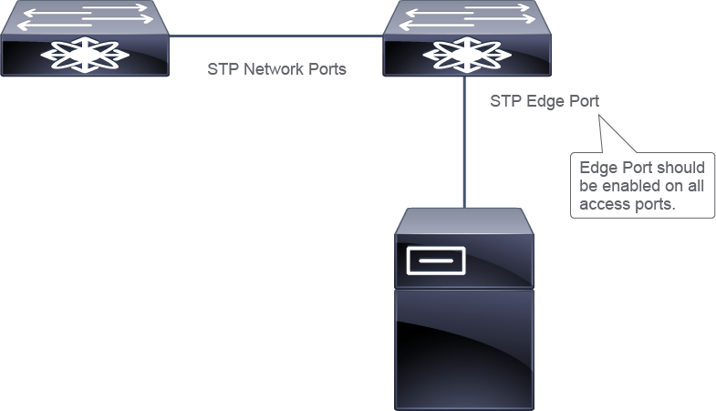
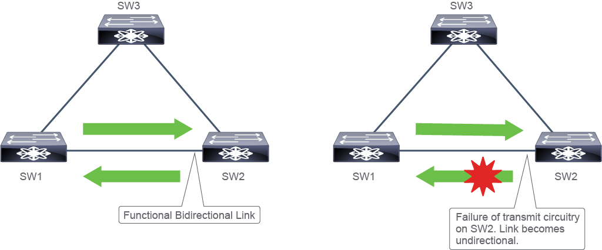

# Spanning Tree Protocol (STP) Extensions

## Overview

Cisco has added extensions to STP that enhance loop prevention, protect against user configuration errors, and provide better control over the protocol parameters.

Available STP extensions are:

- STP Edge Ports (previously known as PortFast)
- BPDU Filter
- BPDU Guard
- Loop Guard
- Root Guard
- Bridge Assurance.

All these extensions can be used with both Rapid PVST+ and MST.

## Key Points

**STP Edge Ports**

- Bypass the spanning tree listening and learning states and move to the forwarding state immediately. Typically used for Layer 2 access ports that are connected to a single workstation or server.
- Disabled by default.

**BPDU Guard**

- If any BPDU is received on an STP edge port, that port is put into an error-disabled state.
- Disabled by default.

**BPDU Filter**

- Force a port to not send any BPDUs.
- Disabled by default.

**Root Guard**

- Does not allow a port to become a root port.
- Disabled by default.

**Loop Guard**

- Detects if an active port is no longer receiving BPDUs and moves that port into the STP loop-inconsistent blocking state.
- Disabled by default.

**Bridge Assurance**

- Port always sends BPDUs, regardless of the port role.
- Enabled by default.

**UniDirectional Link Detection (UDLD)**

- Periodically transmits UDLD packets on an interface with enabled UDLD. If the packets are not echoed back within a specific time frame, the link is flagged as unidirectional and the interface is error-disabled.
- Disabled by default.

## STP Edge Port

Configuring a Layer 2 access port as a spanning-tree Edge Port causes the port to bypass the spanning tree listening and learning states and move to the forwarding state immediately. This feature was formerly known as PortFast.

Spanning-tree edge ports are typically deployed on Layer 2 access ports that are connected to a single workstation or server. These ports can be considered safe from topology loops.

<main></main>

### Configuration

<pre>
Configure STP Edge on an interface.

interface Ethernet1/1
    spanning-tree port type edge
</pre>

## BPDU Guard

BPDU Guard safeguards the stability of ports set up as STP edge ports. When a BPDU is detected on an STP edge port, the port transitions into an error-disabled state. This results in the port being deactivated and it requires manual reactivation or automatic recovery via the error-disabled timeout feature.

Global BPDU Guard is disabled by default.

### Configuration

<pre>
Configure BPDU Guard on an interface.

interface Ethernet1/1
    spanning-tree bpduguard enable
</pre>

<pre>
Configure BPDU Guard globally.

spanning-tree portfast bpduguard default
</pre>

## BPDU Filter

Using BPDU Filter, you can force a port to not send any BPDUs.

Global BPDU Filter is disabled by default.

### Configuration

<pre>
Configure BPDU Filter on an interface.

interface Ethernet1/1
    spanning-tree bpdufilter enable
</pre>

<pre>
Configure BPDU Filter globally.

spanning-tree portfast bpdufilter default
</pre>

## Root Guard

Activating Root Guard on a port prevents that port from becoming a root port. If a port with Root Guard enabled receives a BPDU that would promote it to a root port, the port transitions into a root-inconsistent state and ceases to forward traffic.

### Configuration

<pre>
Configure Root Guard on an interface.

interface Ethernet1/1
    spanning-tree guard root
</pre>

## Loop Guard

Loop Guard monitors for situations where an active port stops receiving BPDUs, and in response, transitions that port into the STP loop-inconsistent blocking state. If the port resumes receiving BPDUs, suggesting the unidirectional link failure has been resolved, Loop Guard lifts the blocking state from the port.

Loop Guard is disabled by default.

<main></main>

### Configuration

<pre>
Configure Loop Guard on an interface.

interface Ethernet1/1
    spanning-tree guard loop
</pre>

## Bridge Assurance

The Bridge Assurance functionality, which is compatible with Rapid PVST+ and MST, expands upon the concept utilized by loop guard. When Bridge Assurance is enabled on a functioning port, that port continuously sends BPDUs, irrespective of the port's role. BPDUs essentially serve as a greeting protocol between pairs of linked switches. A port set up with Bridge Assurance is expected to receive BPDUs. If a port fails to receive BPDUs, it transitions into the blocking state. Therefore, Bridge Assurance must be activated on both ends of the link.

**Bridge Assurance is enabled only on spanning tree network ports that are point-to-point links.**

**Only applicable with Rapid PVST+ and MST.**

Bridge Assurance is enabled globally by default.

### Configuration

<pre>
Disable Bridge Assurance globally.

no spanning-tree bridge assurance
</pre>

## UniDirectional Link Detection (UDLD)

UniDirectional Link Detection (UDLD) is a Layer 2 protocol exclusive to Cisco. It collaborates with Layer 1 mechanisms to ascertain the physical status of a link. With UDLD enabled, the switch periodically sends out UDLD packets via an interface. If these packets aren't returned within a set time frame, the link is marked as unidirectional and the interface is put into an error-disabled state. For UDLD to effectively detect and disable unidirectional links, devices at both ends of the link must support the protocol.

By default, the UDLD feature is disabled.

Two types of UDLD modes:
- **Informational**: simply logs and alerts issues.
- **Aggressive**: error-disables the interface.

### Configuration

<pre>
Configure UDLD globally on fiber interfaces.

feature udld
</pre>
