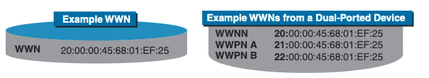
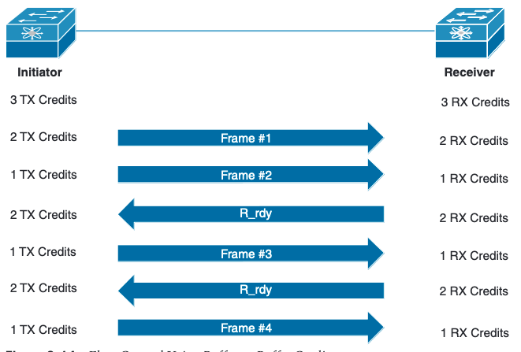
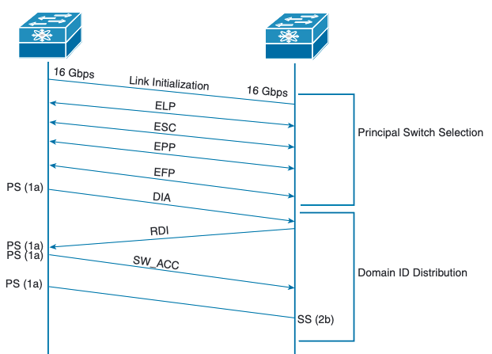
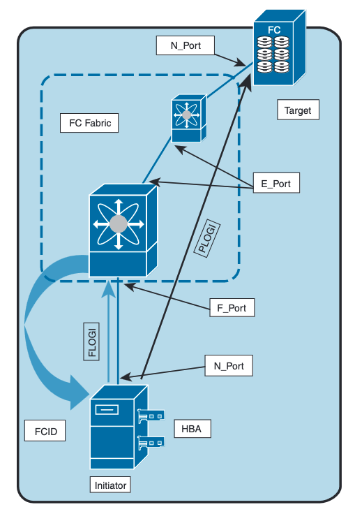

# Fibre Channel Addressing and Databases

## Fibre Channel Addressing

In a Fibre Channel fabric there are two types of addresses:

- World Wide Names (WWNs)

- Fibre Channel Identifiers (FCIDs)

- Word Wide Port Name (WWPN)

- Word Wide Node Name (WWNN)

A WWN is assigned to single device or node to identify itself in teh Fibre Channel fabric.

When a device logs into the fabric, it is assigned a FCID. The FCID is used to route traffic across the fabric.

<main></main>

**Fabric Shortest Path First (FSPF)**

This protocol is used for inter device routing, just like OSPF, it is a link state protocol and can calculate alternative routes as backups incase of a route failure.

**Domain ID in FCID**

The domain ID is the first 8 bits of the FCID. The domain ID is used to identify the fabric that the device is connected to. The domain ID is assigned by the principal switch. This is kind of like a loopback address for the device.

### Reserved FCIDs

<table>
  <thead>
    <tr>
      <th>Fibre Channel Services</th>
      <th>Reserved Addresses</th>
    </tr>
  </thead>
  <tbody>
    <tr>
      <td>Management Server</td>
      <td>0xFFFFFA</td>
    </tr>
    <tr>
      <td>Fabric Controller</td>
      <td>0xFFFFFD</td>
    </tr>
    <tr>
      <td>F_Port Controller/Fabric Login Server</td>
      <td>0xFFFFFE</td>
    </tr>
    <tr>
      <td>Broadcast Address/Server</td>
      <td>0xFFFFFF</td>
    </tr>
    <tr>
      <td>N_Port Controller</td>
      <td>0xFFFFF0</td>
    </tr>
    <tr>
      <td>Multicast Server</td>
      <td>0xFFFFF5</td>
    </tr>
  </tbody>
</table>

### Flow Control

<main></main>

### Switched Fabric Initialization

##### **Principal switch selection**

This phase guarantees the selection of a unique principal switch (PS) across the fabric.

The selection process is done by finding the higher priority switch based on:

- _Run-time priority_: The switch with the lowest set priority is selected. Valid ranges to set to is 1 to 254. The default is 128.

- _Switch WWN_: The switch with the lowest WWN is selected.

##### **Domain ID distribution**

This phase guarantees each switch in the fabric obtains a unique domain ID.

##### **FCID allocation**

This phase guarantees a unique FCID assignment to each device attached to the corresponding switch in the fabric.

##### **Fabric reconfiguration**

This phase guarantees a resynchronization of all switches in the fabric to ensure they simultaneously restart a new principal switch selection phase.

Can be triggered by the following:

- A switch reboot
- A build fabric (BF) frame, which is caused by link failures
- A reconfigure fabric (RCF) frame

#### Switch Fabric Initialization

<main></main>

1. **Exchange Link Parameters (EPL)**: Buffer-to-buffer credits, timers, and CoS are exchanged.

2. **Exchange Switch Capabilities (ESC)**: Entered when teh neighbor establishes routing protocol and agrees on vendor IDs.

3. **Exchange Peer Parameters (EPP)**: Enters if the neighbors are of like models, so they can decide to use Cisco proprietary features.

4. **Exchange Fabric Parameters (EFP)**: This is where the fabric principal switch is established and negotiated.

### Device Registration: FLOGI, PLOGI, PRLI

<main></main>

#### FLOGI

FLOGI happens between an N port and an F port. After an
FC device (host) is attached to the FC fabric, it performs fabric login.
The host (N port) sends the FLOGI request to the well-known **fabric login server address 0xFFFFFE**. The FLOGI frame contains its node name, N port
name, and service parameters. When the fabric switch receives the FLOGI request, it responds with an accept (ACC) frame to the sender while setting appropriate bits on the ACC frame, indicating what service parameters are not supported. Once the fabric login is achieved, the switch assigns FCID to the node.

#### PLOGI

PLOGI happens between two N ports. The N port sends a PLOGI
request to the well-known **directory service address 0xFFFFFC**. The PLOGI frame
contains the port address, port name, node name, B2B_credit capability, and other
service parameters. When both N ports inform about their capabilities to one another using PLOGI requests, they are able to establish logical sessions between the two modes.

### FLOGI and FCNS Databases

The FLOGI database logs every end device (server or storage) that has successfully performed a fabric login and obtained an FCID from the switch.

Fibre Channel switches share the FLOGI database information with each other using the Fibre Channel Name Service (FCNS). The name server functionality running on each switch maintains the FCNS database, which contains the attributes for all hosts and storage devices in each VSAN. Hence, each switch in the fabric learns where each WWN is and how to route traffic to specific WWNs. The name server permits an N port to register attributes during a PLOGI (to the name server) to obtain attributes of other hosts. These attributes are deregistered when the N port logs out either explicitly or implicitly.

**In short, the FCNS database lists devices that are currently logged in to each VSAN, and the FLOGI database displays devices logged in to per switch.**
