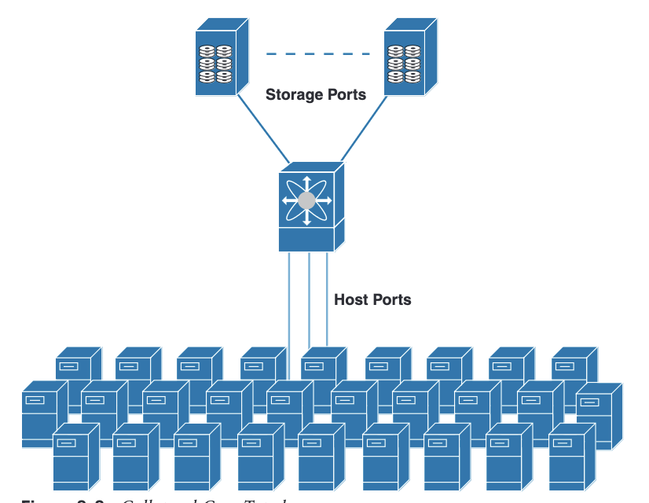
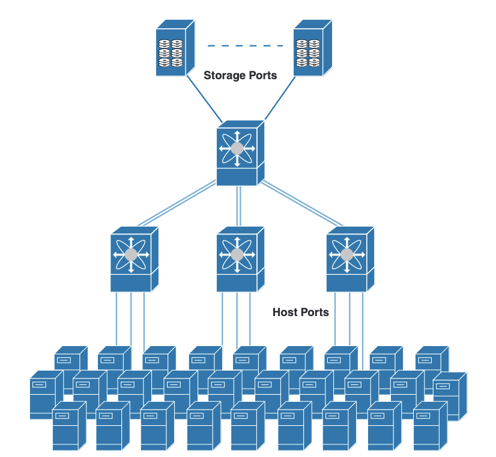
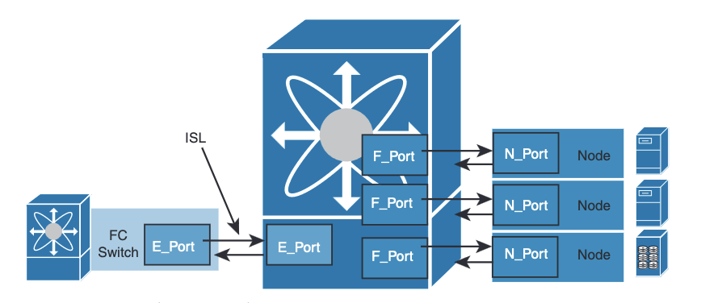

# Fiber Channel Topologies and Ports

## Topologies

### Collapsed Core

<main></main>

### Core Edge

<main></main>

### Edge Core Edge

<main></main>

## Port Types

<main></main>

### E Port

In expansion port (E port) mode, an interface functions as a fabric expansion port. This port can be connected to another E port to create an inter-switch link between two switches. E ports carry frames between switches for configuration and fabric management. They serve as a conduit between switches for frames destined for remote N ports. An E port connected to another switch can also be configured to form a port channel.

### F Port

In fabric port (F port) mode, an interface functions as a fabric port. This port can be connected to a peripheral device (host or disk) operating as an N port. An F port can be attached to only one N port.

### NP Ports

An NP port is a port on a device that is in NPV mode and connected to the core switch via an F port. NP ports function like N ports, except that in addition to providing N port operations, they also function as proxies for multiple physical N ports.

### TE Port

In trunking E port (TE port) mode, an interface functions as a trunking expansion port. It can be connected to another TE port to create an extended ISL (EISL) between two switches. TE ports expand the functionality of E ports to support the following:
- VSAN trunking
- Transport quality of service (QoS) parameters
- Fibre Channel traceroute (fctrace) feature

### TF Port

In trunking F port (TF port) mode, an interface functions as a trunking expansion port. It can be connected to another trunked N port (TN port) or trunked NP port (TNP port) to create a link between a core switch and an NPV switch or a host bus adapter (HBA) in order to carry tagged frames. TF ports expand the functionality of F ports to support VSAN trunking. In TF port mode, all the frames are transmitted in EISL frame format, which contains VSAN information. Interconnected switches use the VSAN ID to multiplex traffic from one or more VSANs across the same physical link.

### TNP Port

In trunking NP port (TNP port) mode, an interface functions as a trunking expansion port. It can be connected to a trunked F port (TF port) to create a link to a core NPIV switch from an NPV switch in order to carry tagged frames.

### Fx Port

Interfaces configured as Fx ports can operate in either F port mode or FL port mode. FL port mode is used in arbitrated loop topology, which we do not discuss in this book. The Fx port mode is determined during interface initialization depending on the attached N port. Fx port mode configuration disallows interfaces to operate in any other mode—for example, preventing an interface to connect to another switch.

### Auto Mode

Interfaces configured in auto mode can operate in F port, E port, TE port, or TF port mode. The port mode is determined during interface initialization. For example, if the interface is connected to a node (host or disk), it operates in F port mode depending on the N port mode. If the interface is attached to a third-party switch, it operates in E port mode. If the interface is attached to another FC switch—for example, Cisco MDS 9000 Series multilayer switches, it may become operational in TE port mode.